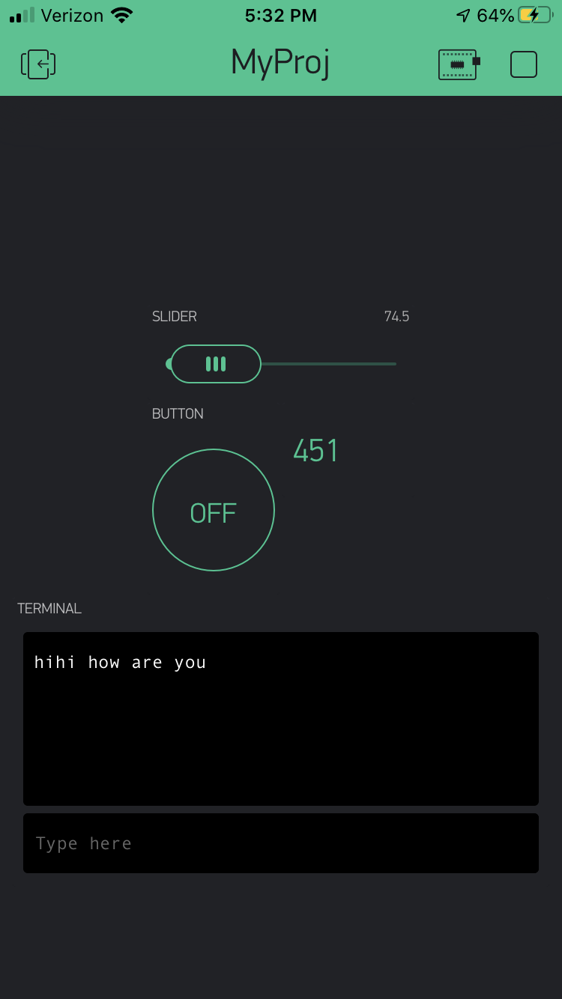

Name: Mark Liao

EID: mzl235

Team Number: 15

## Questions

1. What is the purpose of an IP address?

    IP addresses are unique identifiers to connect with other devices over the internet.
2. What is a DNS? What are the benefits of using domain names instead of IP addresses?

    DNS stands for domain name service. They useful in that they are much easier to memorize.

3. What is the difference between a static IP and a dynamic IP?

    A static IP is a permanent number assigned to a computer by an ISP whereas dynamic IP addresses change over time.

4. What is the tradeoff between UDP and TCP protocols?

    TCP is slow but reliable, whereas UDP is fast but non-guaranteed transfers ("best effort").

5. Why can't we use the delay function with Blynk?

    Blynk is asynchronous and event-based.

6. What does it mean for a function to be "Blocking"?

    A blocking function prevents other functions from being called for significant periods of time.

7. Why are interrupts useful for writing Non-Blocking code?

    I/O is issued asychronously, and when it is completed an interrupt is generated.

8. What is the difference between interface and implementation? Why is it important?

   Interface is how a function is called, and implementation is what the function does.

9. Screenshot of your Blynk App:

    
